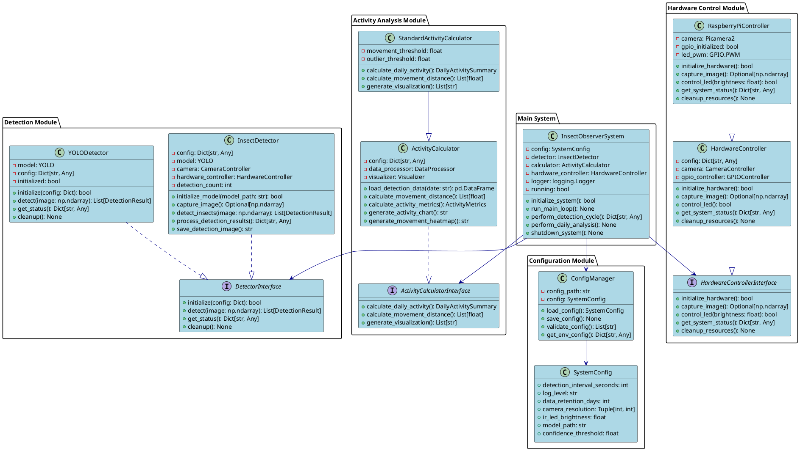
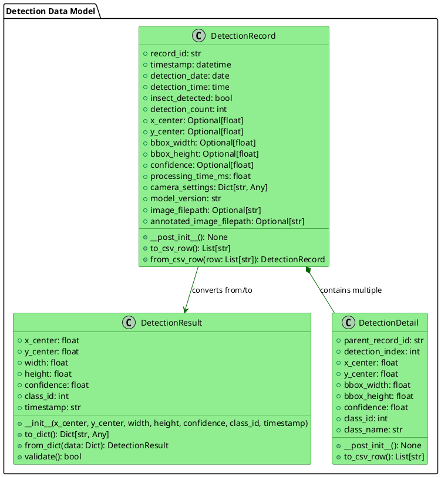
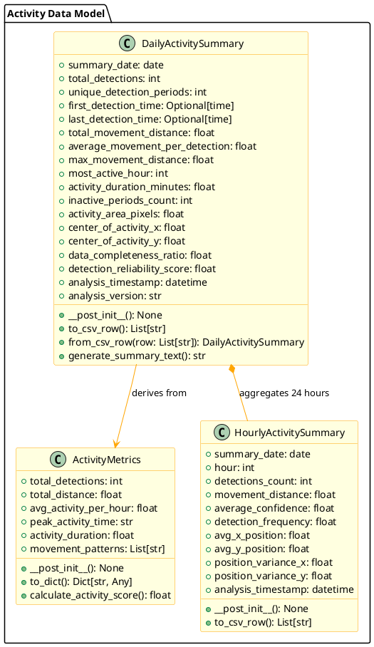
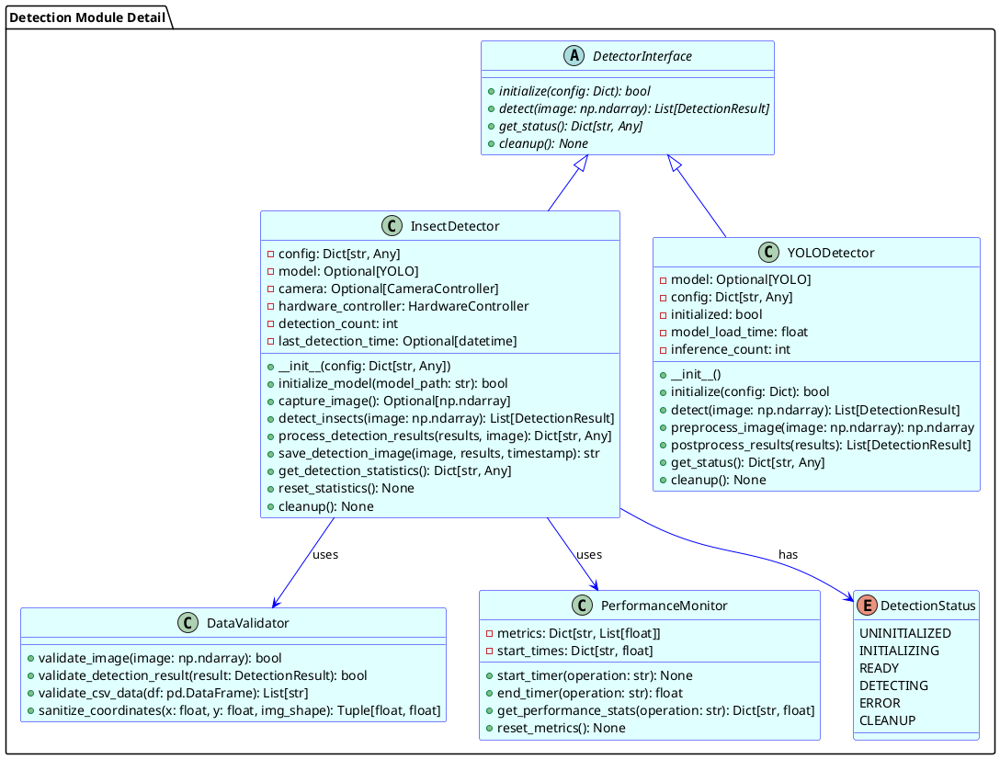
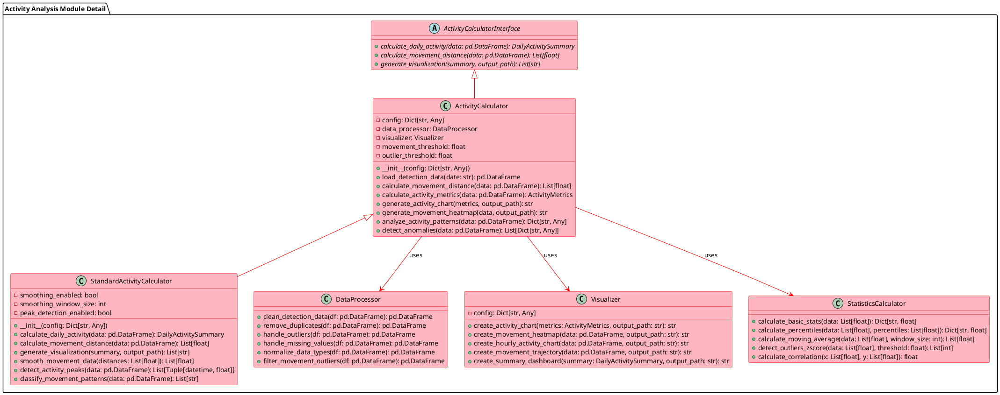
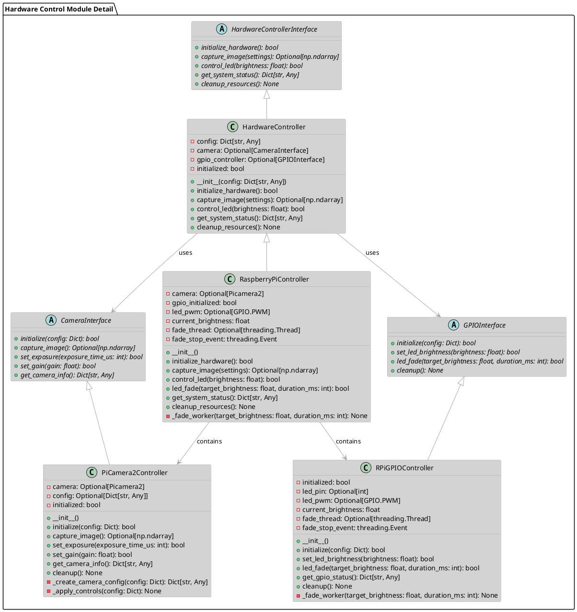

# クラス図設計書

**文書番号**: 12-003-CLASS-001  
**プロジェクト名**: 昆虫自動観察＆ログ記録アプリ  
**文書名**: クラス図設計書  
**バージョン**: 1.0  
**作成日**: 2025-07-25  
**作成者**: 開発チーム  

---

## 1. 文書概要

### 1.1 目的
本文書は昆虫自動観察システムのクラス構造をPlantUML図で可視化し、クラス間の関係性、継承構造、依存関係を明確に定義する。

### 1.2 適用範囲
- システム全体のクラス構造
- モジュール別クラス図
- データモデルクラス図
- インターフェース・抽象クラス定義
- クラス間の関係性（継承・集約・依存）

### 1.3 関連文書
- ソフトウェア設計書（software_design.md）
- データ設計書（data_design.md）
- システムアーキテクチャ設計書（system_architecture_design.md）

---

## 2. システム全体クラス図

### 2.1 全体構成クラス図

### 2.2 クラス関係性の説明

| 関係 | 説明 | PlantUML記法 |
|------|------|-------------|
| **継承 (Inheritance)** | StandardActivityCalculator は ActivityCalculator を継承 | `--|>` |
| **実装 (Realization)** | 具象クラスがインターフェースを実装 | `..|>` |
| **集約 (Aggregation)** | InsectObserverSystem が各モジュールを集約 | `-->` |
| **依存 (Dependency)** | ConfigManager が SystemConfig に依存 | `-->` |

---

## 3. データモデルクラス図

### 3.1 検出データモデル

### 3.2 活動量データモデル

---

## 4. モジュール別詳細クラス図

### 4.1 検出モジュール詳細図

### 4.2 活動量算出モジュール詳細図

### 4.3 ハードウェア制御モジュール詳細図

---

## 5. 実装時の注意事項

### 5.1 クラス設計ガイドライン

#### 5.1.1 継承vs集約の選択
- **継承を使う場合**: IS-A関係（StandardActivityCalculator は ActivityCalculator である）
- **集約を使う場合**: HAS-A関係（InsectObserverSystem は DetectorInterface を持つ）

#### 5.1.2 インターフェース設計原則
- 各インターフェースは単一責任を持つ
- 実装クラスは複数のインターフェースを実装可能
- 依存性注入でテスタビリティを向上

#### 5.1.3 エラーハンドリング戦略
- 階層化された例外クラス構造
- 各モジュールで適切な例外タイプを発生
- ErrorHandlerで統一的な処理

### 5.2 実装優先順位

#### 5.2.1 Phase 1: 基盤クラス
1. データモデルクラス（DetectionResult, ActivityMetrics等）
2. 設定管理クラス（SystemConfig, ConfigManager）
3. 基本インターフェース定義

#### 5.2.2 Phase 2: コア機能クラス
1. ハードウェア制御クラス
2. 検出器クラス
3. 活動量算出クラス

#### 5.2.3 Phase 3: 統合・運用クラス
1. メインシステムクラス
2. イベントシステム
3. 診断・監視クラス

### 5.3 テスト戦略

#### 5.3.1 単体テスト対象
- 各データモデルクラスの検証機能
- アルゴリズム実装クラス（移動距離計算等）
- ユーティリティクラス

#### 5.3.2 統合テスト対象
- インターフェース実装の互換性
- モジュール間のデータ受け渡し
- エラーハンドリングの連携

#### 5.3.3 モックオブジェクト使用箇所
- ハードウェア制御（カメラ・GPIO）
- 外部API連携（Hugging Face）
- ファイルシステム操作

---

*文書バージョン: 1.0*  
*最終更新日: 2025-07-25*  
*承認者: 開発チーム*